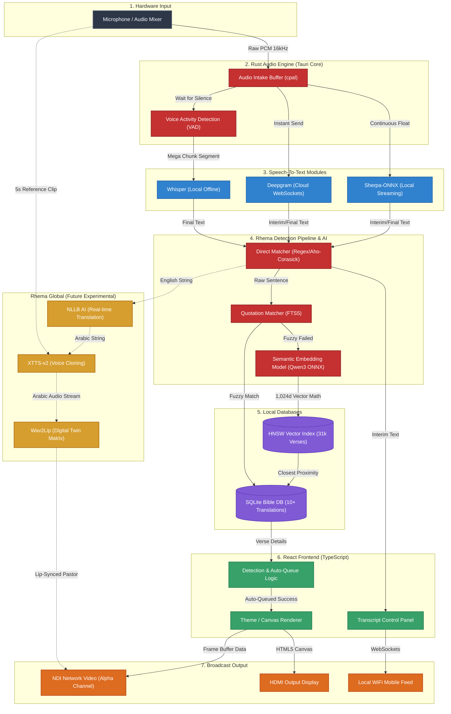

# Rhema AI Architecture & Flow Diagram

This diagram visualizes the complete end-to-end data flow of the Rhema application, from raw audio intake to the final NDI broadcast output. It also includes the future "Rhema Global" integrations.

